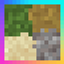
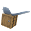

# Minecraft 1.21.1
NeoForge 21.1.176

# mods
| IMG | Name | Version | Other |
----|----|----|----
|  | AppleSkin | 3.0.8+mc1.21 | - |
|  | BetterF3 | 11.0.3 | - |
|  | Cloth Config API | 15.0.140 | - |
|  | Continuity | 3.0.01.21 | - |
|  | CreativeCore | 2.13.26 | - |
|  | Do a Barrel Roll | 3.7.3 | - |
|  | EnhancedVisuals | 1.8.25 | - |
|  | Forgified Fabric API | 0.115.6+2.1.4+1.21.1 | No 0.116.7 |
|  | Iris Shaders | 1.8.12-snapshot+mc1.21.1-local | - |
|  | Jade | 15.10.5+neoforge | - |
| .jpeg) | Just Enough Items (JEI) | 19.27.0.340 | - |
|  | Patchouli | 1.21.1-92-NEOFORGE | - |
|  | Scarlet | 0.2.1 | https://github.com/cbginoshoo/Scarlet |
|  | Simple Voice Chat | 1.21.1-2.6.11 | - |
|  | Sinytra Connector | 2.0.0-beta.12+1.21.1 | - |
|  | Sodium | 0.6.13+mc1.21.1 | - |
|  | WorldEdit | 7.3.8+6939-7b32b45 | - |

## config
| IMG | Name | Config | Other |
----|----|----|----
|  | BetterF3 | .toml | - |

# resourcepacks
| IMG | Name | Version | Other |
----|----|----|----
|  | totem da capoeira | 1.3 | - |
|  | Flandre Scarlet's Wings | 1.0 | https://www.curseforge.com/minecraft/texture-packs/flandre-scarlet-s-wings |

# shaderpacks
| IMG | Name | Version | Other |
----|----|----|----
|  | ScarletEdition | r5.2.2-1.0.1 | - |

config

| IMG | Name | Config | Other |
----|----|----|----
|  | ScarletEdition | .txt | - |

# Server
| Server Address | XXX.XXX.XXX.XXX |
----|----

| List | Name | Other |
----|----|----
| CPU | Intel Core i7-4790S (4.0GHz)| Haswell Refresh |
| GPU | Nvidia GeForce GTX 1660 Super (6GB)| Turing |
| RAM | DDR3-1600MHz 16GB (4GB x4)| -Xms4G -Xmx6G |
| M/B | ASUS Z97-PRO GAMER | Intel Z97 Express |
| SSD | M.2 NVMe SSD 128GB (Gen2 x2)| And HDD250GB |
| Power | 500W (80+ Platinum) | KRPW-PT500W/92+ |
| OS | Windows 11 Home | TPM1.2 |