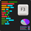
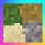
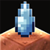
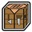
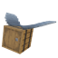
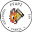
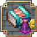
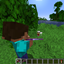
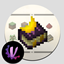
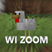

# Minecraft 1.21.1
NeoForge 21.1.176

# mods
| IMG | Name | Version | Other |
----|----|----|----
|  | Amendments | 1.21-2.0.8 | No 1.21-2.0.9 |
|  | AppleSkin | 3.0.8+mc1.21 | - |
|  | Architectury-API | 13.0.8 | - |
|  | BetterF3 | 11.0.3 | - |
|  | Cloth Config API | 15.0.140 | - |
|  | Comforts | 9.0.5+1.21.1 | - |
|  | Continuity | 3.0.01.21.neoforge | - |
|  | Cool Rain | 1.1.0 | client only |
|  | CraftTweaker | 21.0.35 | - |
|  | CreativeCore | 2.13.26 | - |
| .png) | Curios API (Forge/NeoForge) | 9.5.1+1.21.1 | - |
|  | Do a Barrel Roll | 3.7.3 | - |
|  | EnhancedVisuals | 1.8.25 | - |
|  | Forgified Fabric API | 0.115.6+2.1.4+1.21.1 | No 0.116.7+2.2.3+1.21.1 |
|  | GeckoLib | 4.8.3 | - |
|  | Iris Shaders | 1.8.12-snapshot+mc1.21.1-local | client only |
|  | Iron's Spells 'n Spellbooks | 1.21.1-3.15.0 | No 1.21.1-3.15.1 |
|  | Jade | 15.10.5+neoforge | - |
| .jpeg) | Just Enough Items (JEI) | 19.27.0.340 | - |
|  | Kawaii Dishes | 1.13 | - |
|  | Kotlin for Forge | 5.11.0 | - |
|  | Leawind's Third Person | 2.3.0 | - |
|  | libIPN | 6.6.2 | - |
| .png) | MmmMmmMmmMmm (Target Dummy) | 1.21-2.0.11 | - |
|  | Moonlight Lib | 1.21-2.22.2 | No 1.21.1-2.22.3 |
|  | Particle Rain | 4.0.0-beta.5 | client only |
|  | Patchouli | 1.21.1-92-NEOFORGE | - |
|  | playerAnimator | 2.0.4+1.21.1 | - |
|  | Reese's Sodium Options | 1.8.3+mc1.21.4 | - |
|  | Scarlet | 0.2.1 | https://github.com/cbginoshoo/Scarlet |
|  | Simple Voice Chat | 1.21.1-2.6.11 | - |
|  | Sinytra Connector | 2.0.0-beta.12+1.21.1 | - |
|  | Sodium | 0.6.13+mc1.21.1 | - |
|  | Sodium Extra | 0.6.0+mc1.21.1 | - |
|  | Supplementaries | 1.21-3.4.14 | No 1.21-3.4.15 |
|  | WI Zoom | 1.6-MC1.21.1-NeoForge | client only |
|  | WorldEdit | 7.3.8+6939-7d32b45 | single only |
|  | Yes Steve Model | 2.6.2-neoforge+mc1.21.1 | - |

## config
| IMG | Name | Config | Other |
----|----|----|----
|  | BetterF3 | .toml | - |
|  | Yes Steve Model | .ysm, .zip | /Yes_Steve_Model/custom/* |

# resourcepacks
| IMG | Name | Version | Other |
----|----|----|----
|  | totem da capoeira | 1.3 | - |
|  | Flandre Scarlet's Wings | 1.0 | https://www.curseforge.com/minecraft/texture-packs/flandre-scarlet-s-wings |

# scripts
| IMG | Name | Version | Other |
----|----|----|----
|  | CraftTweaker | .zs | - |

# shaderpacks
| IMG | Name | Version | Other |
----|----|----|----
|  | ScarletEdition | r5.2.2-1.0.1 | - |

config

| IMG | Name | Config | Other |
----|----|----|----
|  | ScarletEdition | .txt | - |

# Server
| Server Address | XXX.XXX.XXX.XXX |
----|----
| Name | - |

| List | Name | Other |
----|----|----
| CPU | Intel Core i7-4790S (4.0GHz)| Haswell Refresh |
| GPU | Nvidia GeForce GTX 1660 Super (6GB)| Turing |
| RAM | DDR3-1600MHz 32GB (8GB x4)| -Xms12G -Xmx16G |
| M/B | ASUS Z97-PRO GAMER | Intel Z97 Express |
| SSD | M.2 NVMe SSD 128GB (Gen2 x2)| And 250GB RAID1 (HDD x2) |
| Power | 500W (80+ Platinum) | KRPW-PT500W/92+ |
| OS | Windows 11 Home | TPM1.2 |
